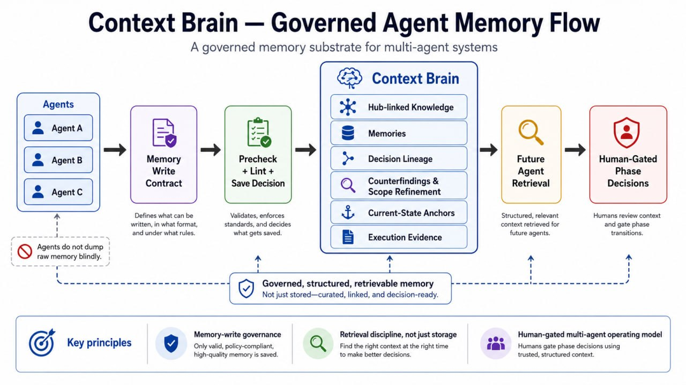
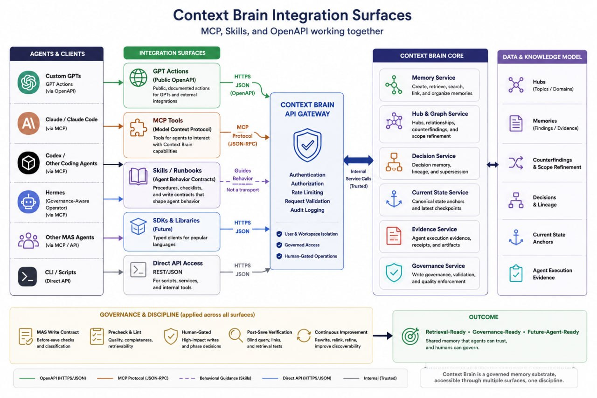

# Context Brain (Public Alpha)

Context Brain is a memory + knowledge-graph backend for AI agents.

## Public-alpha scope

This repository is currently in **public alpha**. The public surface is intentionally conservative.
This first public-alpha baseline is documentation/schema-only: it includes public docs, MCP documentation, and a curated read-only GPT Actions schema, but not the full Context Brain runtime/source distribution.
LLM providers are configuration-driven via environment variables in supported runtime paths; no single provider is implied as universally mandatory by this baseline.

- GPT Actions v1 is **read-only**.
- Public GPT Actions schema is maintained separately from internal OpenAPI.
- openapi.json should be treated as an internal/generated reference for maintainers.

## What makes Context Brain different

Context Brain is not just a vector-memory store. Its core focus is governed agent memory: helping agents decide what should be saved, how it should be linked, how contradictions should be represented, and how future agents can retrieve evidence without inheriting the full chat history.

- Memory-write governance
- Hub-linked knowledge organization
- Decision memory and lineage
- Counterfinding and scope refinement
- Current-state anchors
- Agent execution evidence
- Retrieval discipline, not just storage
- Human-gated multi-agent operating model

## Governed agent memory flow

## Integration surfaces

## What this does not claim

- This does not claim the public release is fully ready for production.
- This does not claim GPT Actions write tools are supported.
- This does not claim full API stability across all endpoints.
- This does not claim demo seeds have passed live runtime smoke in every environment.

## Start here

- Quick setup: QUICK_START.md
- API public-alpha guide: API_REFERENCE.md
- GPT Actions setup (read-only v1): docs/GPT_ACTIONS_SETUP.md
- Security scope: SECURITY.md
- Privacy scope: PRIVACY.md
- Stability policy: STABILITY_POLICY.md
- Governance model overview: GOVERNANCE_MODEL.md
- Demo usage notes: DEMO_GUIDE.md
